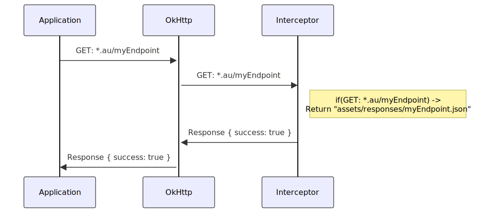

<!-- _class: lead -->


# Android UI testing
#### Theory and Practice

---

# Agenda for today

-  Deep dive into UI testing 
-  Native Android UI Testing
-  Mocks
-  Conclusion

---

<!-- _class: lead -->


# Dive into UI testing 

---

<style>
img[alt~="center"] {
  display: block;
  margin: 0 auto;
}
</style>

#  Deep dive into UI testing 

Software testing pyramid


---

#  Why do we need tests?

  * Confidence (Dont repeat your mistakes)
  * Continuous deployment 
  * Screenshots generation
  * Application assessement speed up

---

#  Feature development process


* Discussion of functionality
* Discussion of assessement criteria
* Feature implimentation
* Unit and UI tests implimentation
* Validation by QA

---

#  Basic feature state machine


---

#  Assesement creterias

* Loading
* Empty
* Reload from Empty
* Content
* Reload from Content
* Error
* Reload from Error
* Cross feature navigation
---

#  Abstract test case scenario

`.../featureA/assesement.yaml`
```yaml
- case: 
  - id: featureAContentIsDisplayed
  - scenario:
  Open Feature A screen
  Wait for Content
  Verify that Loading is not dispalyed  
  Verify that Error is not dispalyed
  Verify that 3 items displayed in list
  Verify 1 item title is equals "Test title 1"  
  Verify 2 item title is equals "Test title 2"  
  Verify 3 item title is equals "Test title 3"
```

---


# Agenda for today

-  Dive into UI testing 
-  Native Android UI Testing
-  Mocks
-  Conclusion

---

<!-- _class: lead -->


# Native Android UI Testing

---

<style>
img[alt~="center"] {
  display: block;
  margin: 0 auto;
}
</style>

#  Native Android UI Testing

* How to write?
  * Native / Cross platform
  * Content / Screenshot
* How to run?
  * Locally / Remotely
  * Environment
* How to scale?
  * Run in parallel

---

#  Frameworks


---

#  Native Android Frameworks

|Espresso|Kakao|Kaspresso|
|---|---|---|
||||

---


#  Pros and Cons (Espresso )

|Pros|Cons|
|---|---|
|:white_check_mark: Supported by Google|:x: Lots of boilerplate|
|:white_check_mark: Native Android test library|:x: Depends on API version|
|:white_check_mark: Most popular UI testing framework|:x: Resources assertion and matching not supported out of the box|
|:white_check_mark: Fast||


---

#  Pros and Cons (Kaspresso )

|Pros|Cons|
|---|---|
|:white_check_mark: Testing for ADB calls such as SMS, Calls, Geolocation and etc|:x: Requred ADB server|
|:white_check_mark: Build-in flakiness retries|:x: Tricky for scaling|
|:white_check_mark: Allure report|:x: Parallel runs on CI|
|:white_check_mark: Steps support||
|:white_check_mark: Based on Kakao||

---


#  Why Kakao?

* Espresso
```Kotlin
onView(allOf(withId(R.id.price_item),hasDescendant(withText("Standard Rate"))))
        .check(matches(withEffectiveVisibility(Visibility.VISIBLE)));
```
* Kakao

```Kotlin
onScreen<FormScreen> {
    price {
        isVisible()
    }
}
```

---

#  Typed page objects

```Kotlin
class FormScreen : Screen<FormScreen>() {
    val phone = KEditText { withId(R.id.phone) }
    val email = KEditText { withId(R.id.email) }
    val submit = KButton { withId(R.id.submit) }
}
```

```Kotlin
onScreen<FormScreen> {
    phone {
        hasText("971201771")
    }
    submit {
        click()
    }
}
```

---

#  Recycler support

```
class Item(parent: Matcher<View>) : KRecyclerItem<Item>(parent) {
    val title: KTextView = KTextView(parent) { withId(R.id.title) }
}
```

```Kotlin
val recycler: KRecyclerView = KRecyclerView(
  { withId(R.id.recycler_view) },
  itemTypeBuilder = { itemType(::Item) })
```
```
onScreen<RecyclerScreen> {
    recycler {
        firstChild<Item> {
            title { hasText("Title 1") }
       ...
```
---

#  Compose support

```Kotlin
class MainActivityScreen(semanticsProvider: SemanticsNodeInteractionsProvider) :
    ComposeScreen<MainActivityScreen>(
        semanticsProvider = semanticsProvider,
        viewBuilderAction = { hasTestTag("MainScreen") }
    ) {

    val myButton: KNode = child {
        hasTestTag("myTestButton")
    }

    val myButton2: KNode = myButton.child {
        hasTestTag("myTestButton2")
    }
}
```

---

#  Compose support

```Kotlin
class ExampleInstrumentedTest {
    @Rule
    @JvmField
    val composeTestRule = createAndroidComposeRule<MainActivity>()

    @Test
    fun simpleTest() {
        onComposeScreen<MainActivityScreen>(composeTestRule) {
            myButton {
                assertIsDisplayed()
                assertTextContains("Button 1")
            }

            onNode { hasTestTag("doesNotExist") }.invoke {
                assertDoesNotExist()
            }
        }
    }
}

```
---
#  Quick refresh ...


`.../featureA/assesement.yaml`
```yaml
- case: 
  - id: featureAContentIsDisplayed
  - scenario:
  Open Feature A screen
  Wait for Content
  Verify that Loading is not dispalyed  
  Verify that Error is not dispalyed
  Verify that 3 items displayed in list
  Verify 1 item title is equals "Test title 1"  
  Verify 2 item title is equals "Test title 2"  
  Verify 3 item title is equals "Test title 3"
```

---

#  Scenario Implementation

```Kotlin
@Test
fun featureAContentIsDisplayed()
onScreen<FeatureAScreen> {
    waitFor(R.id.title)
    loading { isNotDisplayed() }
    error { isNotDisplayed() }
    list { 
      isDisplayed() 
      childAt(0)<Item> { title { hasText("Test title 1") } }
      childAt(1)<Item> { title { hasText("Test title 2") } }
      childAt(2)<Item> { title { hasText("Test title 3") } }
    }
}
```

---

#  Kakao + Marathon = :revolving_hearts:

|Kakao|Marathon|
|---|---|
|:white_check_mark: Nice and simple DSL |:white_check_mark: Flakiness controll strategies|
|:white_check_mark: Typed page objects |:white_check_mark: Easy to scale|
|:white_check_mark: Recycler support|:white_check_mark: Can be integrated with CI|
|:white_check_mark: Compat API support|:white_check_mark: Supports custom configurations for your needs|
|:white_check_mark: Lots of Matcher and Assetions|:white_check_mark: Allure reporting|

---


# Agenda for today

-  Dive into UI testing 
-  Native Android UI Testing
-  Mocks
-  Conclusion

---

<!-- _class: lead -->


# Mocks

---

#  Mocks

* What are we testing?
  * Feature
  * Integration
* Why do we need mocks?
  * Performace improvement
  * Tests results stability
  * Control for 3rd party code

---

#  Mocks

* Deployment
  * Local
  * Remote
* Type
  * Stateless
  * Stateful
---

#  Testing with remote Prod server

|Pros|Cons|
|---|---|
|:white_check_mark: Testing whole HTTP stack|:x: Extra time for request-response processing|
|:white_check_mark: Good for Integration testing|:x: Bad for Feature testing|
||:x: Stateful|
||:x: Unstable results and branching in tests logic|

---

#  Testing with remote server (Mocks)


---
#  Testing with remote server (Mocks)

|Pros|Cons|
|---|---|
|:white_check_mark: Testing whole HTTP stack|:x: Extra time for request-response processing|
|:white_check_mark: Single remote instance |:x: Required redeploy in case of mock updates|
|:white_check_mark: Stable results for UI testing |:x: Required redeploy in case of mock updates|
|:white_check_mark: Stateless |:x: Not supporting custom error codes|


---

#  Local Mocks (Entry level)



---

#  Local Mocks (Entry level)

|Pros|Cons|
|---|---|
|:white_check_mark: Easy to implement|:x: HTTP Stack not tested|
|:white_check_mark: Fast responses |:x: Not shared between platforms|
|:white_check_mark: Static mock going as part of application ||
|:white_check_mark: Can be executed anywhere ||


---

#  Local Mocks (Intermediate)

* Custom ```TestRule```'s for custom behaviours
  * Response codes
  * Throttling
  * Responses alligned with Test Suits requrements
---

#  Local Mocks (Advanced)


---

#  Local Mocks (Advanced)

|Pros|Cons|
|---|---|
|:white_check_mark: HTTP Stack tested |:x:  Required extra affort to implement|
|:white_check_mark: Mocks responses in-app |:x: Unsynchronized with "Production server"|
|:white_check_mark: Good for Features test|:x: Bad for Integration test|
|:white_check_mark: Can be run as "Remote server" ||
|:white_check_mark: Customizable behaviours ||


---

<!-- _class: lead -->


# Conclusion

---


#  Conclusion

* Always undestand what you want to test
* Choose a right tooling set
* Ask yourself "How this code will change in 3 years"
* Think about scaling
* Questions?